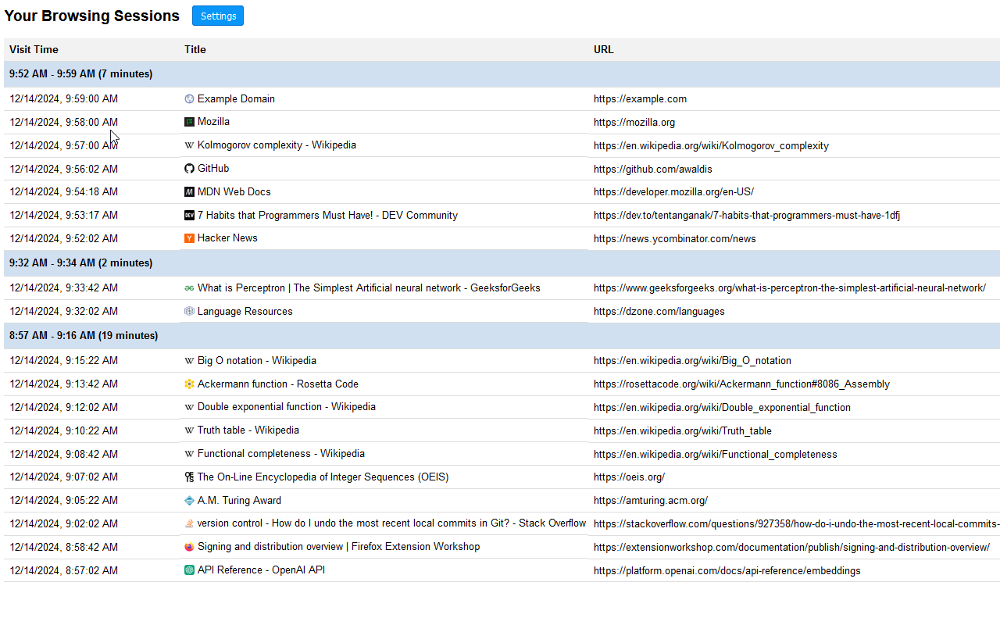

# display-browser-history

This repository contains the code for a Firefox browser extension that reads your browser history and organizes individual entries into web browsing "sessions" based on their proximity in time. The extension displays the start time, end time, duration of each session, and provides a more meaningful overview of your web browsing habits.

### Installation

This extension has not yet been submitted to Mozilla for signing. To use it, you must install it as a temporary extension via [about:debugging](about:debugging#/runtime/this-firefox). Select "manifest.json".

### Compatibility

This extension has been developed and tested exclusively with Firefox.

### Screenshot

Below is a screenshot of the extension in action:

